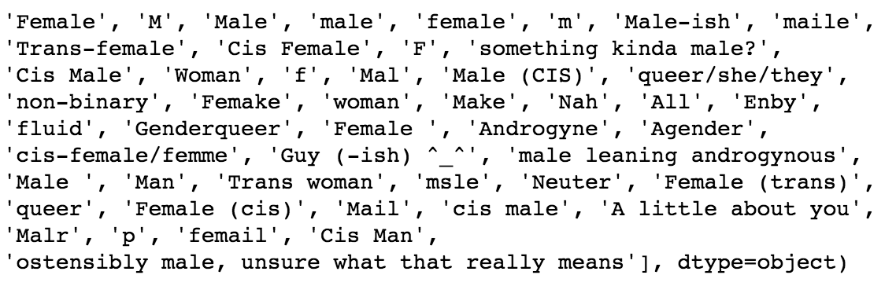

# capstone_1_mental_health
Capstone 1: Mental Health in the Tech Industry
### Problem
Over the past 10 years mental health has finally gained more attention and importance in society.  The occurrence of a mental health issues can not only cause major issues in one's personal life but can also disrupt the success of any company.  As we are focused in data science this project chooses to look at those issues specifically in the tech industry.  There are many factors that can cause the occurrence of a mental health issue which need exploration.  This project uses the 2014 data set collected from 1260 persons currently working in the tech industry.  The goal was to explore three different metrics and their relation to the occurrence of a mental health issue.

#### Data
This data set comes from [Open Sourcing Mental Illness, LTD] and is available at (https://www.kaggle.com/osmi/mental-health-in-tech-survey).  An ongoing survey currently exists as well for 2016 which could be used for future projects.  

The dataset did require a large amount of cleaning specifically in the gender column which was one of the metrics explored. This will be further explained in the following section.  

Two other metrics, company size and family history of mental illness, were also explored.  From the initial EDA and plotting two metrics indicated some significance and underwent hypothesis testing.

#### Cleaning of the Data
As mentioned above the gender column required a large amount of cleaning in order to remove user input data that was not uniform.  This can be seen here by examining the unique results from the column. 

After a large series of replacement commands the data was made to be uniform.  The resulting amount of data points where however reduced from 1260 to 1240.

Thankfully for the remaining metrics of family history and company size no cleaning had to be done.

#### Methods
To examine each metric, sex, company size, and family history, initially through the use of seaborn the normalized percentage occurrence was plotted.  From this information two metrics appeared to have some significance and required hypothesis testing.   An example of the method used for the two proportion can be found here (https://newonlinecourses.science.psu.edu/stat414/node/268/).
